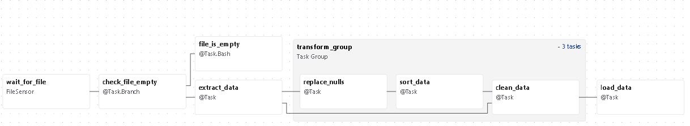
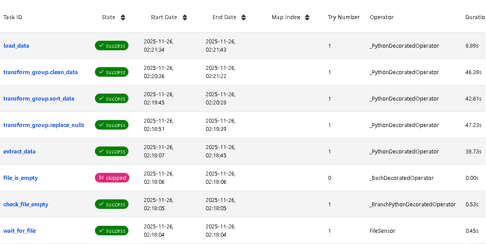
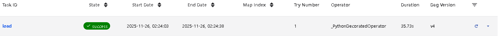
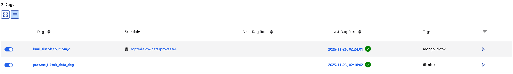

# TikTok Data Pipeline

This project implements a **data pipeline** using **Apache Airflow 3**, which processes TikTok CSV files and loads them into **MongoDB**. It leverages **Data-Aware Scheduling (Datasets)** for automatic triggering when new files appear in a directory.

---

## 📂 Project Structure

```
airflow_tiktok_project/
├── config/
├── core/
│   ├── airflow/
│   ├── dags/
│   │   ├── data/
│   │   │   ├── raw/
│   │   │   └── processed/
│   │   └── include/
│   └── utils/
├── handlers/
│   ├── csv_handler.py
│   ├── file_handler.py
│   └── mongo_handler.py
├── queries/
├── tasks/
│   ├── consts.py
│   ├── load_to_mongo_dag.py
│   └── process_tiktok_data_dag.py
├── docker_compose/
│   └── docker-compose.yml
├── tests/
│   ├── test_csv_handler.py
│   └── test_mongo_handler.py
├── .gitignore
├── .pre-commit-config.yaml
├── Makefile
├── pyproject.toml
└── README.md

```

### 1️⃣ `Graph view of the first DAG`



### 2️⃣ `Results of completing the tasks of the FIRST dag`



### 3️⃣ `Results of completing the tasks of the SECOND dag`



### 4️⃣ `General picture of the execution of two dags`


